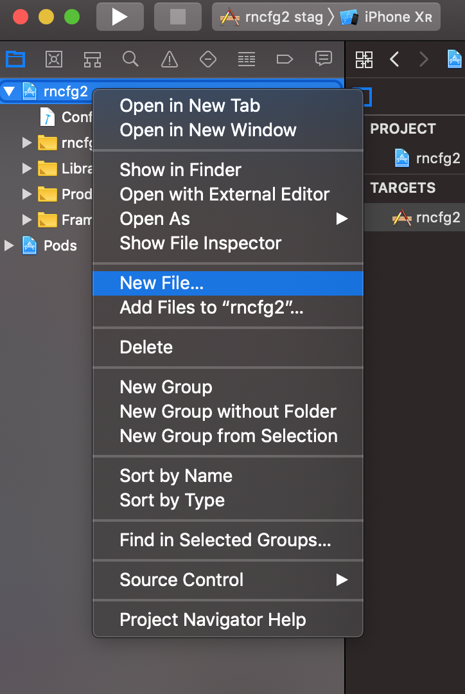
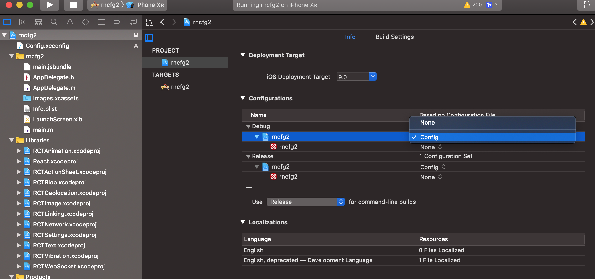
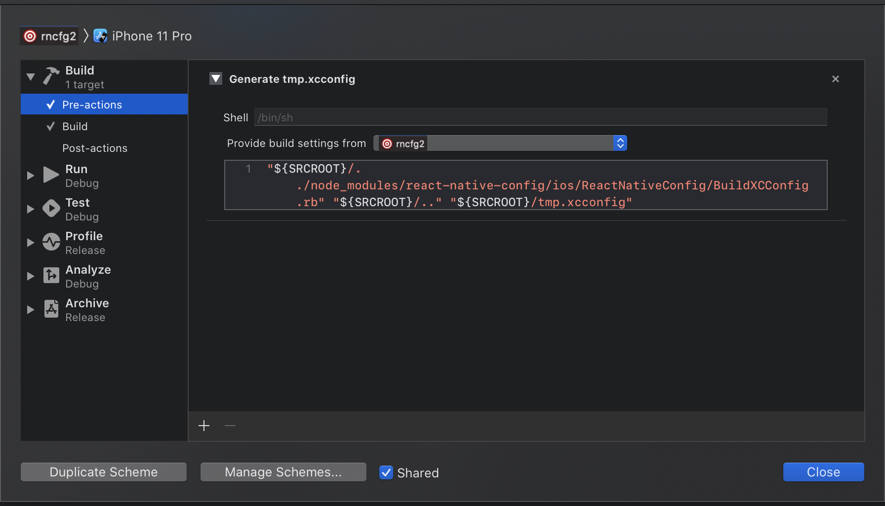

# Config variables for React Native apps

Module to expose config variables to your javascript code in React Native, supporting iOS, Android and Windows.

Bring some [12 factor](http://12factor.net/config) love to your mobile apps!

## Basic Usage

Create a new file `.env` in the root of your React Native app:

```
API_URL=https://myapi.com
GOOGLE_MAPS_API_KEY=abcdefgh
```

Then access variables defined there from your app:

```js
import Config from "react-native-config";

Config.API_URL; // 'https://myapi.com'
Config.GOOGLE_MAPS_API_KEY; // 'abcdefgh'
```

Keep in mind this module doesn't obfuscate or encrypt secrets for packaging, so **do not store sensitive keys in `.env`**. It's [basically impossible to prevent users from reverse engineering mobile app secrets](https://rammic.github.io/2015/07/28/hiding-secrets-in-android-apps/), so design your app (and APIs) with that in mind.

## Setup

Install the package:

```
$ yarn add react-native-config
```

Link the library:

(Note: For React Native 0.60 or greater, [autolinking](https://reactnative.dev/blog/2019/07/03/version-60#native-modules-are-now-autolinked) is available)

(Note: For Windows, this module supports autolinking when used with `react-native-windows@0.63`
or later. For earlier versions you need to manually link the module.)

```
$ react-native link react-native-config
```

if cocoapods are used in the project then pod has to be installed as well:

```
(cd ios; pod install)
```

 - Manual Link (iOS)

	1. In XCode, in the project navigator, right click `Libraries` ➜ `Add 		Files to [your project's name]`
	2. Go to `node_modules` ➜ `react-native-config` and add 		`ReactNativeConfig.xcodeproj`
	3. Expand the `ReactNativeConfig.xcodeproj` ➜ `Products` folder
	4. In the project navigator, select your project. Add 		`libReactNativeConfig.a` to your project's `Build Phases` ➜ `Link Binary With Libraries`
	5. And go the Build Settings tab. Make sure All is toggled on (instead of Basic)
	6. Look for Header Search Paths and add `$(SRCROOT)/../node_modules/react-native-config/ios/**` as `non-recursive`


 - Manual Link (Android) 

	**android/settings.gradle**
	
	```diff
	+ include ':react-native-config'
	+ project(':react-native-config').projectDir = new File(rootProject.projectDir, '../node_modules/react-native-config/android')
	```
	**android/app/build.gradle**
	
	```diff
	dependencies {
		implementation "com.facebook.react:react-native:+"  // From node_modules
	+	implementation project(':react-native-config')
	}
	```
	**MainApplication.java**
	
	```diff
	+ import com.lugg.ReactNativeConfig.ReactNativeConfigPackage;
	
	@Override
	protected List<ReactPackage> getPackages() {
		   return Arrays.asList(
           		new MainReactPackage()
	+      		new ReactNativeConfigPackage()
	    );
	}
	```

 - Manual Link (Windows)

	**windows/myapp.sln**

	Add the `RNCConfig` project to your solution.

	1. Open the solution in Visual Studio 2019
	2. Right-click Solution icon in Solution Explorer > Add > Existing Project  
	  - if using `react-native-windows@0.62` or later select `node_modules\react-native-config\windows\RNCConfig\RNCConfig.vcxproj`
		- if using `react-native-windows@0.61` select `node_modules\react-native-config\windows\RNCConfig61\RNCConfig61.vcxproj`

	**windows/myapp/myapp.vcxproj**

	Add a reference to `RNCConfig` to your main application project. From Visual Studio 2019:

	1. Right-click main application project > Add > Reference...  
	Check `RNCConfig` from Solution Projects.

	**pch.h**

	Add `#include "winrt/RNCConfig.h"`.

	**app.cpp**

	Add `PackageProviders().Append(winrt::RNCConfig::ReactPackageProvider());` before `InitializeComponent();`.

### Extra step for Android

You'll also need to manually apply a plugin to your app, from `android/app/build.gradle`:

```
// 2nd line, add a new apply:
apply from: project(':react-native-config').projectDir.getPath() + "/dotenv.gradle"
```

#### Advanced Android Setup

In `android/app/build.gradle`, if you use `applicationIdSuffix` or `applicationId` that is different from the package name indicated in `AndroidManifest.xml` in `<manifest package="...">` tag, for example, to support different build variants:
Add this in `android/app/build.gradle`

```
defaultConfig {
    ...
    resValue "string", "build_config_package", "YOUR_PACKAGE_NAME_IN_ANDROIDMANIFEST.XML"
}
```

## Native Usage

### Android

Config variables set in `.env` are available to your Java classes via `BuildConfig`:

```java
public HttpURLConnection getApiClient() {
    URL url = new URL(BuildConfig.API_URL);
    // ...
}
```

You can also read them from your Gradle configuration:

```groovy
defaultConfig {
    applicationId project.env.get("APP_ID")
}
```

And use them to configure libraries in `AndroidManifest.xml` and others:

```xml
<meta-data
  android:name="com.google.android.geo.API_KEY"
  android:value="@string/GOOGLE_MAPS_API_KEY" />
```

All variables are strings, so you may need to cast them. For instance, in Gradle:

```
versionCode project.env.get("VERSION_CODE").toInteger()
```

Once again, remember variables stored in `.env` are published with your code, so **DO NOT put anything sensitive there like your app `signingConfigs`.**

### iOS

Read variables declared in `.env` from your Obj-C classes like:

```objective-c
// import header
#import "ReactNativeConfig.h"

// then read individual keys like:
NSString *apiUrl = [ReactNativeConfig envFor:@"API_URL"];

// or just fetch the whole config
NSDictionary *config = [ReactNativeConfig env];
```

### Windows

You can access variables declared in `.env` from C++ in your App project:
```
std::string api_key = ReactNativeConfig::API_KEY;
```

Similarly, you can access those values in other project by adding reference to the `RNCConfig` as described in the manual linking section.

#### Availability in Build settings and Info.plist

With one extra step environment values can be exposed to "Info.plist" and Build settings in the native project.

1. click on the file tree and create new file of type XCConfig
   
   
2. save it under `ios` folder as "Config.xcconfig" with the following content:

```
#include? "tmp.xcconfig"
```

3. add the following to your ".gitignore":

```
# react-native-config codegen
ios/tmp.xcconfig

```

4. go to project settings
5. apply config to your configurations
   
6. Go to _Edit scheme..._ -> _Build_ -> _Pre-actions_, click _+_ and select _New Run Script Action_. Paste below code which will generate "tmp.xcconfig" before each build exposing values to Build Settings and Info.plist. Make sure to select your target under _Provide build settings from_, so `$SRCROOT` environment variables is available to the script. (Note that this snippet has to be placed after "cp ... \${PROJECT_DIR}/../.env" if [approach explained below](#ios-multi-scheme) is used).

   ```
   "${SRCROOT}/../node_modules/react-native-config/ios/ReactNativeConfig/BuildXCConfig.rb" "${SRCROOT}/.." "${SRCROOT}/tmp.xcconfig"
   ```

   

7. You can now access your env variables in the Info.plist, for example `$(MY_ENV_VARIABLE)`. If you face issues accessing variables, please open a new issue and provide as much details as possible so above steps can be improved.

#### App Extensions

Add dependency to `react-native-config`.

```
target 'ShareExtension' do
  platform :ios, '9.0'

  pod 'react-native-config', :path => '../node_modules/react-native-config'

  # For extensions without React dependencies
  pod 'react-native-config/Extension', :path => '../node_modules/react-native-config'
end
```

### Different environments

Save config for different environments in different files: `.env.staging`, `.env.production`, etc.

By default react-native-config will read from `.env`, but you can change it when building or releasing your app.

The simplest approach is to tell it what file to read with an environment variable, like:

```
$ ENVFILE=.env.staging react-native run-ios           # bash
$ SET ENVFILE=.env.staging && react-native run-ios    # windows
$ env:ENVFILE=".env.staging"; react-native run-ios    # powershell
```

This also works for `run-android`. Alternatively, there are platform-specific options below.

#### Android

The same environment variable can be used to assemble releases with a different config:

```
$ cd android && ENVFILE=.env.staging ./gradlew assembleRelease
```

Alternatively, you can define a map in `build.gradle` associating builds with env files. Do it before the `apply from` call, and use build cases in lowercase, like:

```
project.ext.envConfigFiles = [
    debug: ".env.development",
    release: ".env.production",
    anothercustombuild: ".env",
]

apply from: project(':react-native-config').projectDir.getPath() + "/dotenv.gradle"
```

Also note that besides requiring lowercase, the matching is done with `buildFlavor.startsWith`, so a build named `debugProd` could match the `debug` case, above.

<a name="ios-multi-scheme"></a>

#### iOS

The basic idea in iOS is to have one scheme per environment file, so you can easily alternate between them.

Start by creating a new scheme:

- In the Xcode menu, go to Product > Scheme > Edit Scheme
- Click Duplicate Scheme on the bottom
- Give it a proper name on the top left. For instance: "Myapp (staging)"

Then edit the newly created scheme to make it use a different env file. From the same "manage scheme" window:

- Expand the "Build" settings on left
- Click "Pre-actions", and under the plus sign select "New Run Script Action"
- Where it says "Type a script or drag a script file", type:
  ```
  cp "${PROJECT_DIR}/../.env.staging" "${PROJECT_DIR}/../.env"  # replace .env.staging for your file
  ```
Also ensure that "Provide build settings from", just above the script, has a value selected so that PROJECT_DIR is set.

## Troubleshooting

### Problems with Proguard

When Proguard is enabled (which it is by default for Android release builds), it can rename the `BuildConfig` Java class in the minification process and prevent React Native Config from referencing it. To avoid this, add an exception to `android/app/proguard-rules.pro`:

    -keep class com.mypackage.BuildConfig { *; }

`com.mypackage` should match the `package` value in your `app/src/main/AndroidManifest.xml` file.

If using Dexguard, the shrinking phase will remove resources it thinks are unused. It is necessary to add an exception to preserve the build config package name.

    -keepresources string/build_config_package

### TypeError: _reactNativeConfig.default.getConstants is not a function

This error stems from `.env` file being malformed. Accepted formats are listed here https://regex101.com/r/cbm5Tp/1. Common causes are:
  - Missing the .env file entirely
  - Rogue space anywhere, example: in front of env variable: ` MY_ENV='foo'`

## Testing

Since `react-native-config` contains native code, it cannot be run in a node.js environment (Jest, Mocha). [react-native-config-node](https://github.com/CureApp/react-native-config-node) provides a way to mock `react-native-config` for use in test runners - exactly as it is used in the actual app.

On Windows, [the Example app](example/) supports running automatic tests by using [WinAppDriver](https://github.com/microsoft/WinAppDriver). In the Example app folder run:

```console
yarn appium
yarn test:windows
```

### Jest

For mocking the `Config.FOO_BAR` usage, create a mock at `__mocks__/react-native-config.js`:

```
// __mocks__/react-native-config.js
export default {
  FOO_BAR: 'baz',
};
```

## Meta

Created by Pedro Belo at [Lugg](https://lugg.com/).
